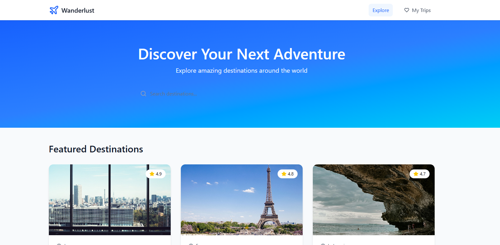
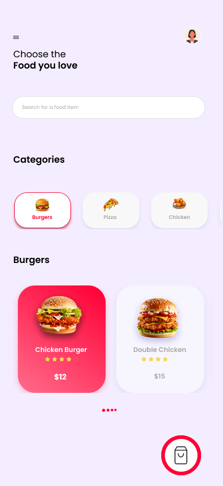

# UI / UX Design Projects

This repository contains UI/UX design concepts created as part of my product design exploration.

The projects focus on clean layouts, intuitive interaction patterns, and modern interface design.

---

## Wanderlust – Travel Exploration UI

A travel discovery interface designed for exploring destinations around the world.

**Features:**
- Hero search section
- Featured destinations cards
- Ratings and trip duration display
- Clean travel-inspired layout

---

## Cravemore – Food Delivery UI

A mobile-first food delivery interface designed for fast browsing and ordering.

**Features:**

- Login and authentication screens

- Food category browsing

- Product cards with ratings

- Basket and checkout UI

---

